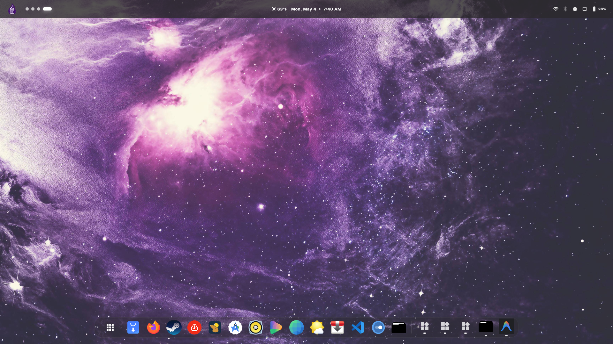
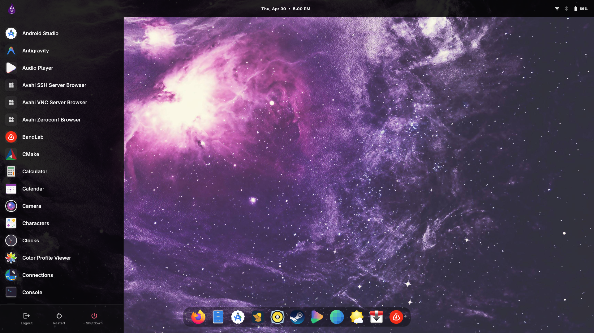
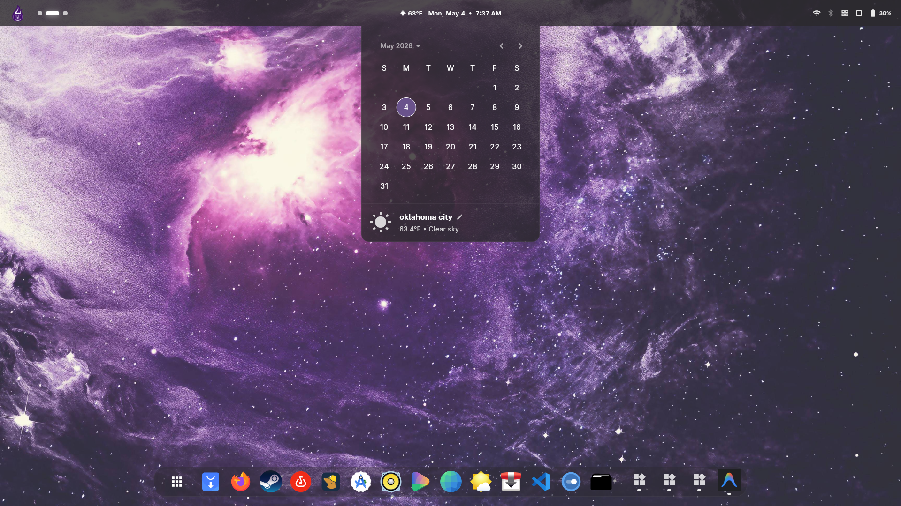
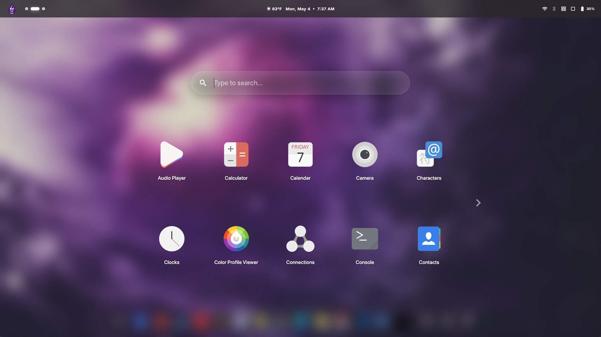
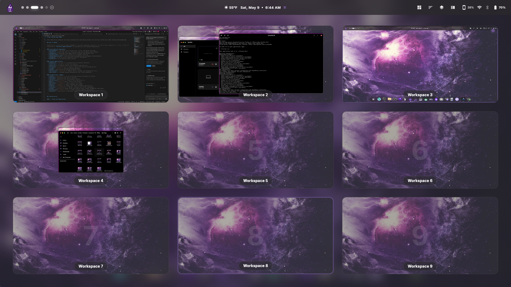
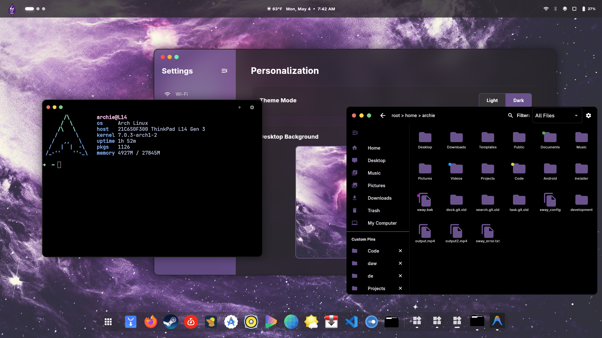
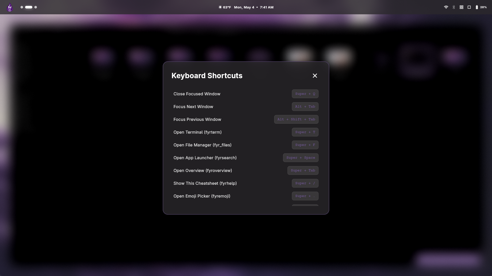
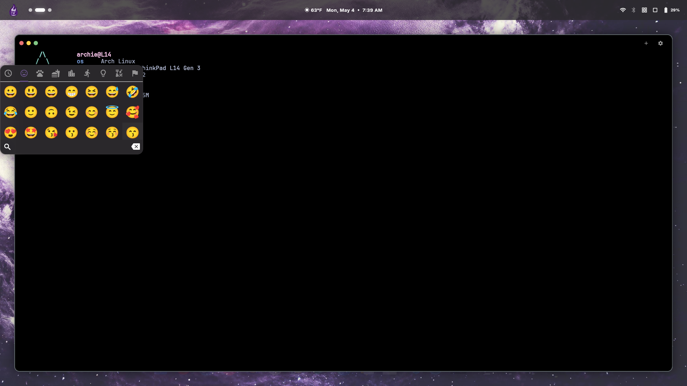

# Fyr Desktop Environment (fyrDE)













This repository contains the core configuration and setup scripts for the fyr Desktop Environment (fyrDE)

## How it Works

FyrDE uses a custom fork of Sway (SwayFX) to provide a Wayland compositor. On top of this compositor, it runs a suite of custom-built **Flutter applications** to provide the core desktop experience:
- **fyrtaskbar**: Top panel with system tray, clock, and quick settings.
- **fyrdock**: macOS-like dock for launching apps and managing open windows.
- **fyrsearch**: Spotlight-like application launcher and search tool.
- **fyroverview**: Exposé-like window and workspace overview.
- **fyrsettings**: Control center for system settings.
- **fyrhelp**: A quick-access keyboard shortcut cheatsheet.
- **fyremoji**: An emoji picker.
- **fyrTerm**: A custom Flutter terminal emulator.
- **fyrFiles**: A custom Flutter file manager.
- **fyrstore**: A software center.

## Installation on Arch Linux

Follow these steps to install all required dependencies and apply the necessary configurations to your system.

### 1. Clone the Repository

First, clone the `fyrDE` repository from GitHub to your local machine and navigate into the `de` folder:

```bash
git clone https://github.com/archieBTW/fyrDE.git
cd fyrDE/de
```

### 2. Run the Install Script

An automated installation script is provided to set up everything on Arch Linux. It handles the installation of `yay` (if not already present), official dependencies via `pacman`, `swayfx` via `yay`, and finally sets up the Sway configuration.

Make the script executable and run it:

```bash
chmod +x install.sh
./install.sh
```

> **Note:** The script will prompt you for your `sudo` password to install system packages.

### What the Script Does:
- **Updates your system** via `pacman -Syu`.
- **Installs base-devel and git** if they are missing.
- **Installs the `yay` AUR helper** to allow installation of AUR packages.
- **Installs System Dependencies:** `swaybg`, `swaylock`, `swayidle`, `xorg-xwayland`, `foot`, `wmenu`, `gtk-layer-shell`, `xdg-desktop-portal` suites, `xclip`, `wl-clipboard`, `brightnessctl`, `wireplumber`, `wlsunset`, `grim`, `wf-recorder`, `ninja`, `clang`, `meson`, `scdoc`, `wayland-protocols`, `pcre2`, `json-c`, `pango`, `cairo`, `gdk-pixbuf2`, `cmake`, `cpio`, `pkg-config`, `gcc`.
- **Installs AUR Dependencies:** `scenefx0.4`, `wlroots0.19`, `xdg-desktop-portal-termfilechooser-hunkyburrito-git`, `flutter`.
- **Installs `swayfx`** by building the local fork.
- **Builds and Installs** all of the Flutter applications.
- **Applies the Configuration:** Creates the `~/.config/sway` directory and copies the `sway/config` from this repository to `~/.config/sway/config`.

### 3. Customization
Before launching, be sure to open your Sway configuration (`~/.config/sway/config`) and update the background setting to point to your desired wallpaper path:
```text
output * bg /path/to/your/wallpaper.jpg fill
```

### 4. Launching
After the installation is complete, you can start the desktop environment from your TTY by running:
```bash
sway
```

## Keyboard Shortcuts

FyrDE relies on standard Sway keyboard shortcuts, with a few custom additions. The main modifier key (`$mod`) is the **Super/Windows** key.

| Action | Shortcut |
|---|---|
| **System** | |
| Lock Screen | `Super + L` |
| Close Window | `Super + Q` |
| Open Application Launcher (Fyrsearch) | `Super + Space` |
| Toggle Overview (Fyroverview) | `Super + Tab` |
| Show Cheatsheet (Fyrhelp) | `Super + Ctrl` |
| Open Emoji Picker (Fyremoji) | `Super + .` |
| Open Terminal (Fyrterm) | `Super + T` |
| Open File Manager (Fyrfiles) | `Super + F` |
| Toggle Floating Mode | `Super + M` |
| Take a Screenshot | `Print Screen` |
| Toggle Screen Recording | `Super + Print Screen` |
| **Window Management** | |
| Change Focus | `Super + Arrow Keys` |
| Resize Window | `Super + Shift + Arrow Keys` |
| Split Horizontally | `Super + H` |
| Split Vertically | `Super + V` |
| Focus Next/Prev Window | `Alt + Tab` / `Alt + Shift + Tab` |
| **Workspaces** | |
| Switch to Workspace 1-10 | `Super + 1-0` |
| Move Window to Workspace 1-10 | `Super + Shift + 1-0` |
| **Touchpad Gestures** | |
| Switch Workspace Prev/Next | `Swipe 3 Fingers Left/Right` |
| Toggle Overview | `Swipe 3 Fingers Down/Up` |
| **Media & Brightness** | |
| Volume Up / Down | `Volume Keys` |
| Mute Audio / Mic | `Mute / Mic Mute Keys` |
| Brightness Up / Down | `Brightness Keys` |
