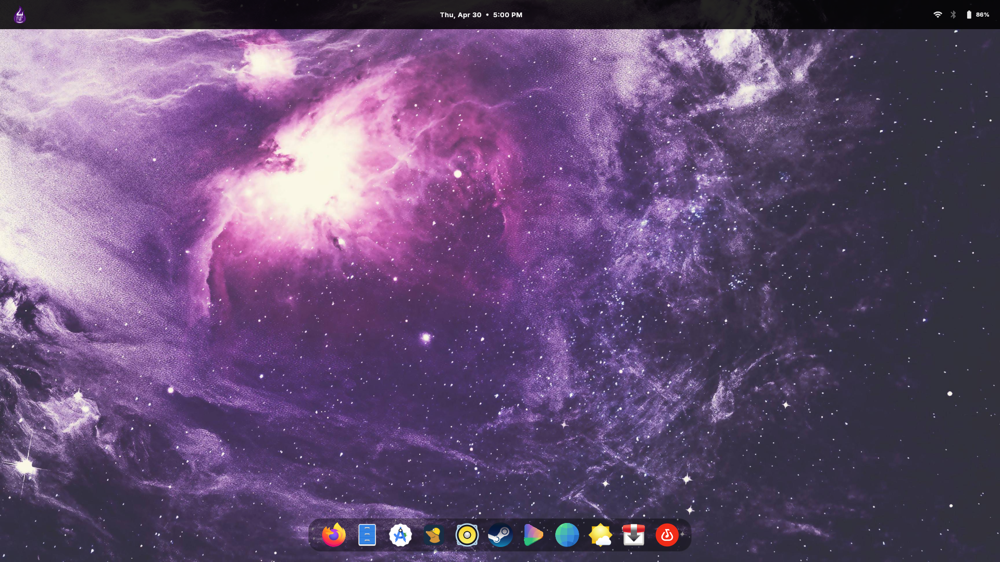
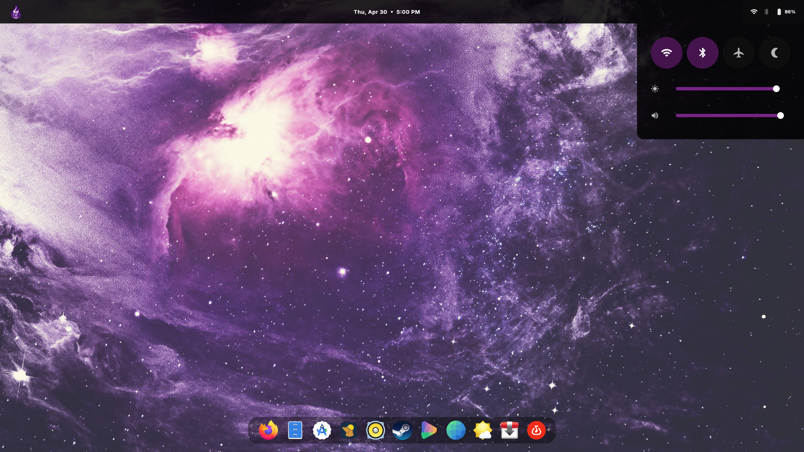
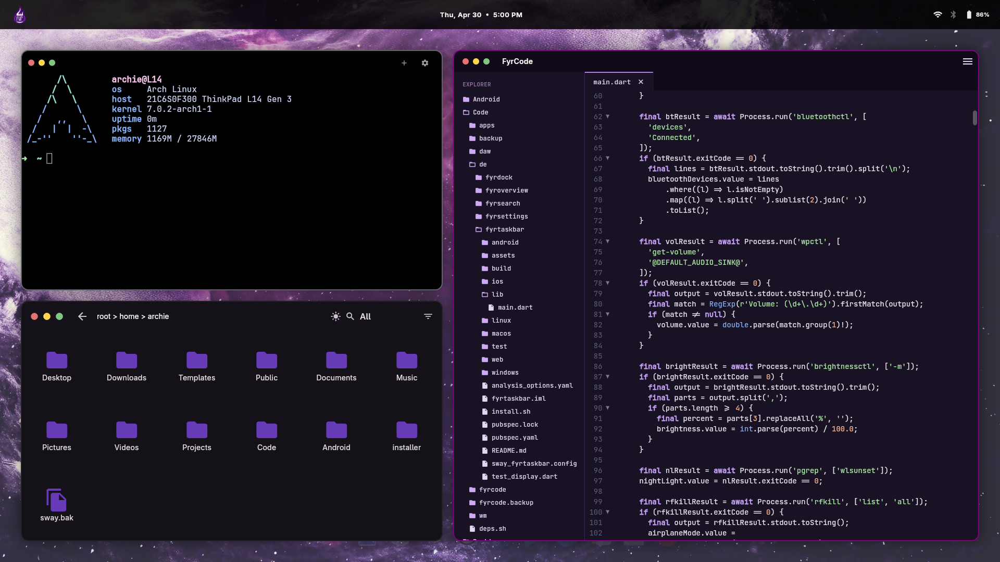
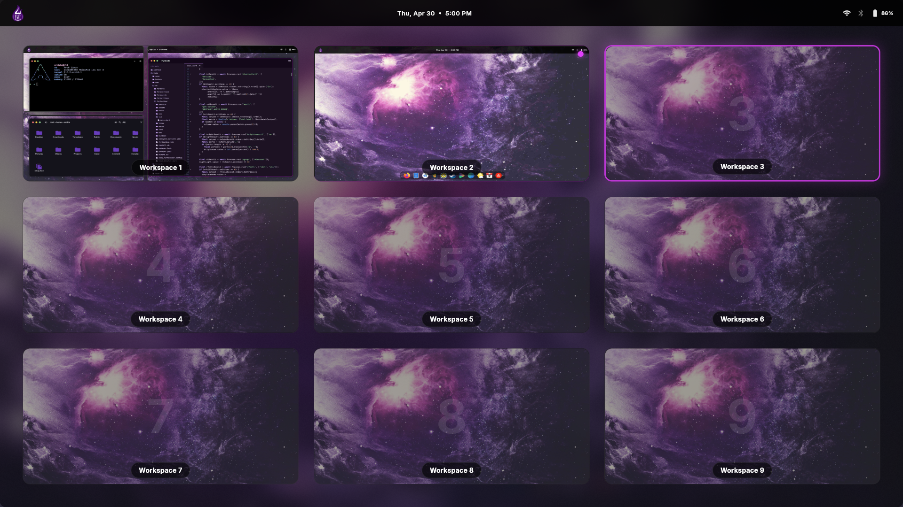

# Fyr Desktop Environment (fyrDE)








This repository contains the core configuration and setup scripts for the fyr Desktop Environment (fyrDE)

## Installation on Arch Linux

Follow these steps to install all required dependencies and apply the necessary configurations to your system.

### 1. Clone the Repository

First, clone the `fyrDE` repository from GitHub to your local machine and navigate into the `de` folder:

```bash
git clone https://github.com/archieBTW/fyrDE.git
cd fyrDE/de
```

### 2. Run the Install Script

An automated installation script is provided to set up everything on Arch Linux. It handles the installation of `yay` (if not already present), official dependencies via `pacman`, `swayfx` via `yay`, and finally sets up the Sway configuration.

Make the script executable and run it:

```bash
chmod +x install.sh
./install.sh
```

> **Note:** The script will prompt you for your `sudo` password to install system packages.

### What the Script Does:
- **Updates your system** via `pacman -Syu`.
- **Installs base-devel and git** if they are missing.
- **Installs the `yay` AUR helper** to allow installation of AUR packages.
- **Installs System Dependencies:** `swaybg`, `swaylock`, `swayidle`, `xorg-xwayland`, `foot`, `wmenu`, `gtk-layer-shell`, `xdg-desktop-portal` suites, `xclip`, `wl-clipboard`, `brightnessctl`, `wireplumber`, `wlsunset`, `grim`, `cmake`, `cpio`, `pkg-config`, `gcc`.
- **Installs `swayfx`** from the AUR.
- **Applies the Configuration:** Creates the `~/.config/sway` directory and copies the `sway/config` from this repository to `~/.config/sway/config`.

### 3. Customization
Before launching, be sure to open your Sway configuration (`~/.config/sway/config`) and update the background setting to point to your desired wallpaper path:
```text
output * bg /path/to/your/wallpaper.jpg fill
```

### 4. Launching
After the installation is complete, you can start the desktop environment from your TTY by running:
```bash
sway
```
