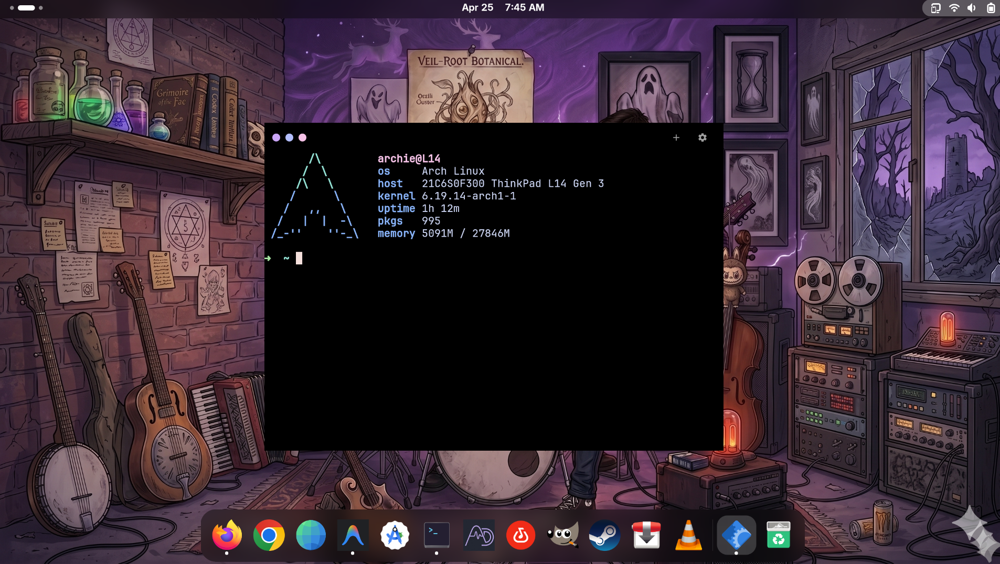

# Flutterm



Flutterm is a modern, beautiful terminal emulator built with Flutter. It combines a highly customizable UI with a robust native PTY backend.

## Features

- **Dynamic Tab Management:** Easily run multiple background terminal sessions in a tabbed environment.
- **Power User Shortcuts:** Fully navigate without lifting your hands from the keyboard (`Ctrl+Shift+T` for new tab, `Ctrl+Shift+W` to close tab, `Ctrl+Tab` to cycle tabs, `Ctrl+Shift+C`/`V` for clipboard).
- **Custom Fonts:** Searchable system fonts built-in, natively bundling high-quality developer fonts like JetBrains Mono and Fira Code for perfect coding ligatures.
- **Customizable Appearance:** Real-time settings for Light/Dark mode, window dimensions, and typography.
- **Process Protection:** Intelligent window and tab close confirmations when PTY processes are actively running.

## Building

To build fyrTerm from source, you must have the Flutter SDK installed on your Linux machine.

```bash
git clone https://github.com/yourusername/fyrTerm.git
cd fyrTerm
flutter pub get
flutter build linux --release
```

## Installation

fyrTerm includes an installation script that automatically builds the application, moves it to your system binaries, and maps the desktop application and icons to your application launcher.

```bash
./install.sh
```

During installation, you will be prompted for `sudo` to securely register the executable to `/usr/local/bin` and update the `hicolor` system icon cache.

After running the install script, simply search for **Flutterm** in your app launcher or type `flutterm` directly into your terminal!
