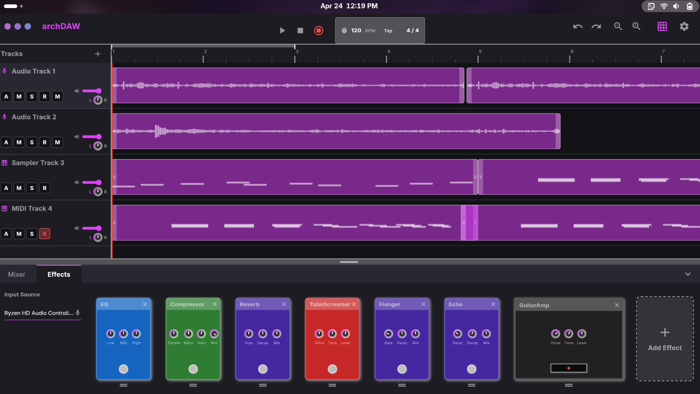

# FyrDAW



A Flutter-based Digital Audio Workstation.

## Building the Project

Ensure you have [Flutter](https://flutter.dev/docs/get-started/install/linux) installed and configured for Linux desktop development.

1. Clone or navigate to the project repository:
   ```bash
   cd /home/archie/Code/de/fyrdaw
   ```
2. Fetch the Flutter dependencies:
   ```bash
   flutter pub get
   ```
3. Build the Linux release:
   ```bash
   flutter build linux
   ```
   This will generate the built executable and required data files in `build/linux/x64/release/bundle/`.

## Installation

The project includes a convenient installation script located in the `installer` directory. This script will automatically detect your package manager, install system dependencies (`alsa-lib`, `ffmpeg`, `zenity`, `fmedia`), copy the built files to `/opt/fyrDAW`, and register a desktop entry so you can launch it from your application menu.

1. Navigate to the `installer` directory:
   ```bash
   cd installer
   ```
2. Make sure the executable and required directories inside match your most recent build. (If needed, copy the contents of `../build/linux/x64/release/bundle/` into the `installer` directory, and ensure the executable is named `fyrDAW`).
3. Run the script with root privileges:
   ```bash
   sudo ./install.sh
   ```

> **Note for Arch Linux Users:** The script uses `pacman` to install most dependencies, but `fmedia` is housed in the AUR. You will need to install it manually using an AUR helper (e.g., `yay -S fmedia`) after the script finishes.

Once the installation is complete, you should be able to find **fyrDAW** in your system's application launcher.
